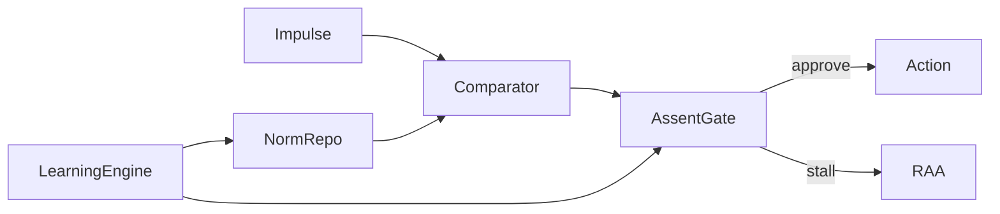

# NES Blueprint v3 ‑ Revised (May 2025)

> **Purpose.** This blueprint specifies the *Normative Executive System* (NES) as a computational cognitive‑control architecture. The present version integrates: (1) learning algorithms and weight‑update mathematics; (2) a parameter‑estimation protocol; and (3) links to open behavioural / neuro‑imaging datasets suitable for model fitting.

---
## 0 · Quick Guide to Modules
| Module | Core Function | Key Params |
| --- | --- | --- |
| **Comparator** | Continuous drift‑diffusion accumulator over impulses. | drift **vᵢ**, noise σ, urgency Uᵢ, norm weight *wₙ* |
| **Assent Gate** | Sets symmetric decision thresholds (Θ). | baseline Θ₀, affective ΔΘ, serotonergic Θ₅HT |
| **Norm Repository** | Stores typed norms with weight *w*, veto flag, context. | w∈[0,1], veto∈{0,1}, decay λ |
| **Conflict Resolver** | Weighted vote + hard veto adjudication. | veto precedence, Σw₊ vs Σw₋ |
| **RAA (Meta‑control)** | Detects impasse, runs bounded recursion, tunes params. | recursion cap Nₘₐₓ, urgency boost ΔU |
| **Learning Engine *new*** | Updates norm weights & gate parameters from experience. | learning rates η (Bayes/HGF) or α (TD), Hebbian factor κ |

---
## 1 · Learning Algorithms (new)
NES supports three complementary update schemes; implementers may choose one or layer them hierarchically.

### 1.1 Bayesian Hierarchical Gaussian Filter (HGF)
For each norm _j_ the latent mean weight *mⱼ* is updated trial‑wise:

\[mⱼ(k)=mⱼ(k-1)+ηⱼ(k)·εⱼ(k)\]

where prediction‑error εⱼ(k)=oⱼ(k)‑σ(*mⱼ*) and learning‑rate η is a precision ratio. This captures normative belief revision under uncertainty. Source: Futurehouse Learning Algorithms report §HGF. citeturn3file0

### 1.2 Reinforcement‑Learning (OpAL‑style actor–critic)
Go/NoGo actors update for reward δₜ:

\[
A_G←A_G+α_G·A_G·δₜ\quad\;A_N←A_N-α_N·A_N·δₜ
\]

Actor values are mapped onto norm weights (*w*=σ(A_G–A_N)). Good for habitual norm internalisation. Source: same report. citeturn3file0

### 1.3 Three‑factor Hebbian (STDP) rule 
\[Δwᵢⱼ=κ·f(δₜ)·\text{pre}_ⱼ·\text{post}_ᵢ\]

Links any impulse‑norm pair that frequently co‑fires and is rewarded (δₜ>0). Implements associative moral learning.

> **Recommendation:** Start with Bayesian HGF for explicit norms; layer TD‑RL for utility learning; reserve Hebbian for low‑level associative tuning.

---
## 2 · Parameter‑Estimation Plan (new)
### 2.1 Fitting Workflow
1. **Behavioural likelihood** – use *Hierarchical DDM* (HDDM) to recover individual drift *v*, threshold Θ and non‑decision time *t₀*.
2. **Norm‑weight posterior** – embed Algorithm 1.1 in PyStan, sample mⱼ posteriors via NUTS.
3. **Joint model** – couple HDDM and HGF in a single hierarchical graph; fit with R‑Stan or PyMC.
4. **Model comparison** – WAIC / LOO‑IC across learning variants.

### 2.2 Open Datasets
| Dataset | Tasks | N | Why useful | Access |
| --- | --- | --- | --- | --- |
| **DMCC55B** (Dual Mechanisms) | Stroop, AX‑CPT, Task switch | 55 | Rich trial‑level RT + fMRI for conflict & rule‑shift; identical to NES demo tasks | OSF `osf.io/tbhfg` |
| **Bissett Self‑Reg** | Stroop, Task switch (fMRI) | 103 | Larger sample for HDDM; clean BIDS format | OpenNeuro `ds004040` |

Recommended pipelines & code are catalogued in Futurehouse Datasets report. citeturn4file1

---
## 3 · Updated Module Interfaces (excerpt)

*LearningEngine* receives prediction‑error δₜ and updates NormRepo weights & AssentGate Θ.

---
## 4 · Methods Appendix (new)
```markdown
**Simulation defaults**
- Δt = 5 ms
- σ = 0.12
- Θ₀ = 1.00 (± affective ΔΘ)
- η prior ~ Beta(1, 1); α_G, α_N ~ Half‑Normal(0, 0.5)
- κ Hebbian factor = 0.001
- Norm decay λ = 0.002 / trial

**Fitting script outline**
1. Pre‑process DMCC Stroop CSV → long‑format dataframe
2. Run HDDM to estimate per‑subject {v, Θ, t₀}
3. Pass trial‑wise accuracy & RT to HGF Stan model; sample 4 × 2 000 chains
4. Posterior predictive check – overlay RT quantiles vs. NES sim
5. Compute WAIC; select best learning variant
```

---
## 5 · Roadmap
| Milestone | Criteria | Target date |
| --- | --- | --- |
| Pilot fit on DMCC Stroop | Convergent posteriors, WAIC<baseline | Jul 2025 |
| Pre‑print of NES with learning | Methods + fit results on OSF | Sep 2025 |
| Neuro‑validation study | STN DBS or EEG‑theta threshold shifts | 2026 |

---
**Contact & license**  © 2025 The Hegemonikon Project.  CC‑BY‑SA 4.0.

